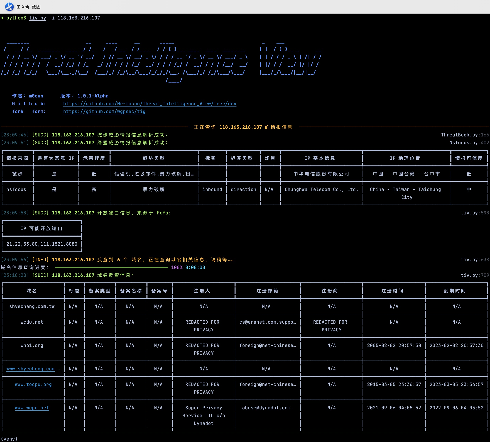
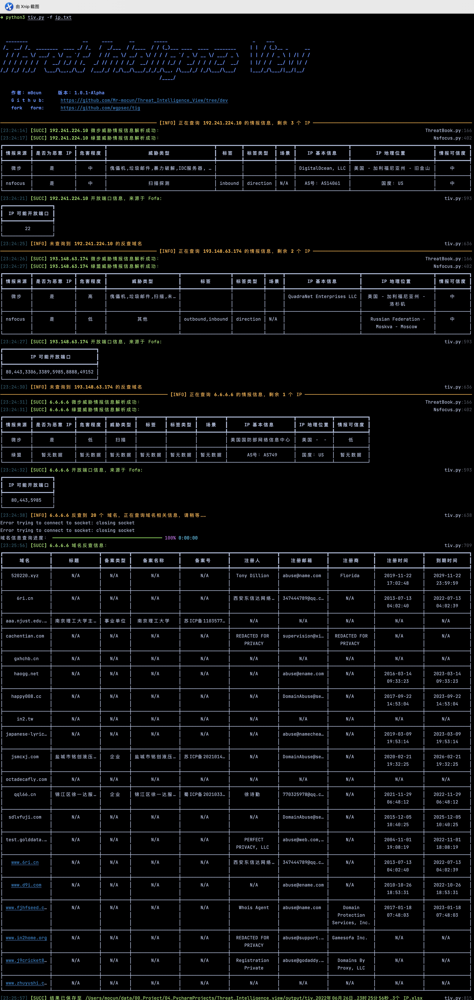
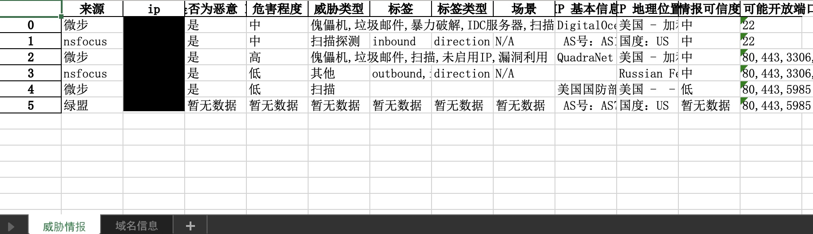
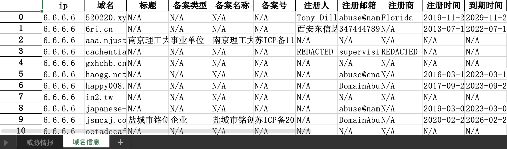

# Updata

## 更新时间：2022 年 06 月 25 日

### 1. 功能优化

1. 添加了 Nsfocus 威胁情报解析结果，但 API 需要自行获取；

2. 优化了配置文件，支持添加多个微步 API key，第一个到达上限后，继续读取下一个，突破了微步 API 每日 50 次的限制；

3. 优化了配置文件，通过对 `Nsfocus_enable`、`FOFA_enable` 、`Revrse_IP_Lookup_enable` 使能开关控制，自定义调整查询结果。

4. 删除通过请求 [api.hackertarget.com](https://api.hackertarget.com/reverseiplookup/?q=x.x.x.x) 来获取 ip 反查域名，由于请求次数每日免费仅 10 次，因此删除该链接；

5. 删除 IP 存活判断。通过 ping 来判断 IP 存活的方式，可靠性不高，因此删除函数调用，但保留了该部分函数；

6. Fofa 官网地址修改，修改了 `fofa` api 获取地址描述，修改了 `fofa` api 接口地址请求；

7. 默认查询单一 IP 不保存文件。实际使用中发现查询单一 ip 威胁情报保存文件的情况并不多，因此修改为默认不保存，但可以通过指定保存文件名的方式来强制保存，示例 `python3 tiv.py -i x.x.x.x -o yyyy(.xlsx)`； `yyyy` 为文件名，后缀名可加可不加；

8. 修改批量查询 IP 读取文件内容筛选 ip 的方式，可以无需按照一行一个 ip 的格式进行书写。可随意书写，通过正则方式匹配 `x.x.x.x` 的格式筛选 ip。

9. 修改批量查询 ip 默认保存输出文件名，不再以时间戳方式保存，修改为年月日时分秒+ip 个数的方式保存；如 `tiv_2022 年 06 月 25 日_16 时 09 分 25 秒_2 个 IP.xlsx`。

10. 重构代码逻辑，按照 PEP8 规范优化部分书写方式，添加注释，函数说明，返回正确值 demo，错误值 demo。

### 2. bug 修复

1. 修改了 ip 反查域名时，若包含多个域名列表时，域名信息（备案信息，注册人，注册商等）仅保存最后一个域名信息。域名相关信息保存至 sheet2（域名信息）中。

2. 修复其他报错情况（如 json 解析异常，whois 返回值未考虑数组等问题），优化进度条被打断等问题。

**fork from：**

        https://github.com/wgpsec/tig

以下部分内容修改自原项目 readme 文档：
***

## 工具介绍

当前该工具获取 IP 的信息有以下几个角度：

1. 微步情报信息 / 绿盟威胁情报信息：获取到 IP 的标签信息、是否恶意 IP、地理位置等等

2. IP 域名反查：获取到 IP 对应的域名，从而根据域名查询到备案信息和 Whois 信息

3. Fofa 信息：获取到 IP 可能开放的端口和 IP 对应的域名信息

假设在获取到的信息最大化情况下，通过 `Threat Intelligence view` 可以一键发现 IP 对应的情报标签、域名、域名注册人、备案邮箱、备案号、备案单位、域名注册商、IP 开放端口、地理位置等等信息。

# 0x01 安装

需要 python3.6 或更高版本支持

```
git clone https://github.com/Mr-mocun/Threat_Intelligence_View.git
cd  Threat_Intelligence_View
pip3 install -r requirements.txt
python3 tiv.py -v
```

# 0x02 使用

## 帮助信息

UNIX 安装指南：

```bash
cd /opt/
git clone https://github.com/Mr-mocun/Threat_Intelligence_View.git
echo '#!/bin/bash
cd /opt/Threat_Intelligence_View
python3 tiv.py $@' > /usr/bin/tiv
chmod +x /usr/bin/tiv
tiv -v
```

工具命令如下：

```
 -h, --help  show this help message and exit
 -c CONFIG   指定配置文件，默认 ./config.ini
 -f FILE     指定 IP 文本，一行一个
 -i IP       指定目标 IP
 -p PROXY    指定代理，比如：http://127.0.0.1:1080 或者 socks5://127.0.0.1:1080
 -o OUTPUT   导出为 excel 表格，例如 output.xlsx
```

## 配置文件

如果是第一次使用本工具，在启动时会提示输入您的微步 API、绿盟 API（需要自行获取）和 Fofa 邮箱及 API


查看自己微步 API  Key 的地址为：[https://x.threatbook.cn/v5/myApi](https://x.threatbook.cn/v5/myApi)，免费账户有每天 50 次的限额，通过添加多个 api key 可突破每日 50 次请求限制。

查看自己 Fofa API Key 的地址为：[https://fofa.info/userInfo](https://fofa.info/userInfo)，普通会员每次免费前 100 条，高级会员每次免费前 10000 条。

## 基础用法

```bash
python3 tiv.py -i x.x.x.x
python3 tiv.py -i x.x.x.x -o xxxx
python3 tiv.py -f ip.txt
```

例如这里要获取某个 IP 的信息，直接使用 -i 命令即可，默认单一 ip 不保存文件，可通过 -o 指定导出文件位置。



或者直接指定一个 IP 列表，结果自动保存到 output 文件夹中，以当前时间 + ip 个数方式命令的 `.xlsx` 表格中。



导出表格文件信息如下




# 0x03 最后

如果各位师傅在使用工具的过程中发现存在 bug 或者有好的建议，欢迎多多提 issue。

如果感觉使用起来还不错，欢迎师傅赏个 Star！！！！
